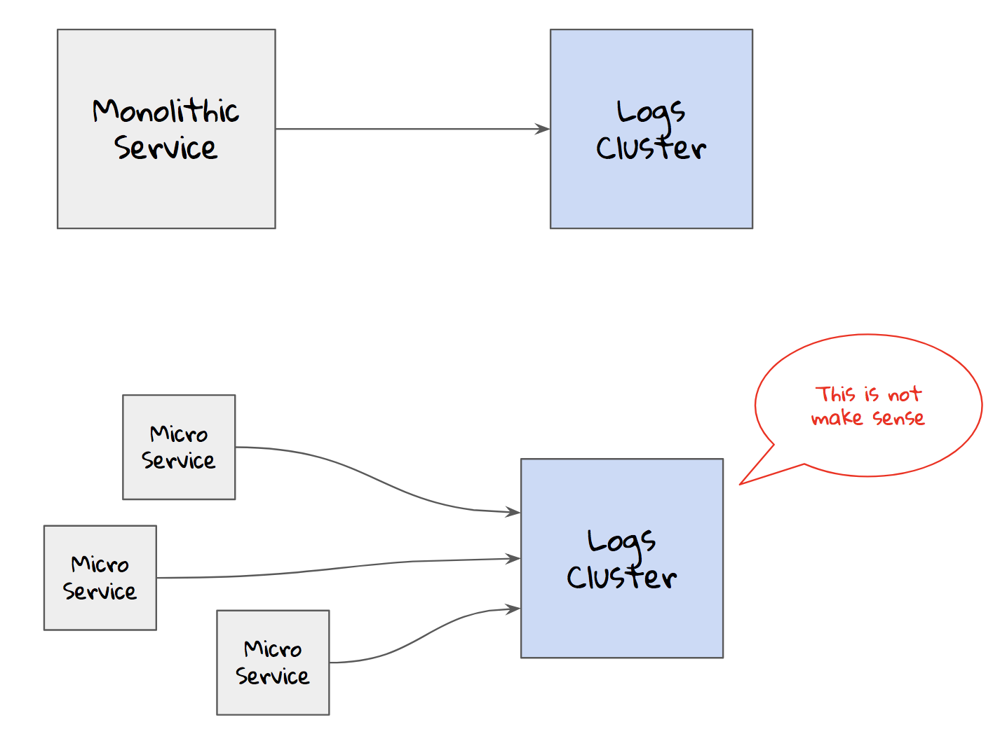
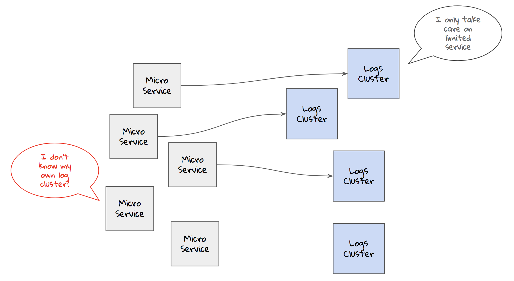
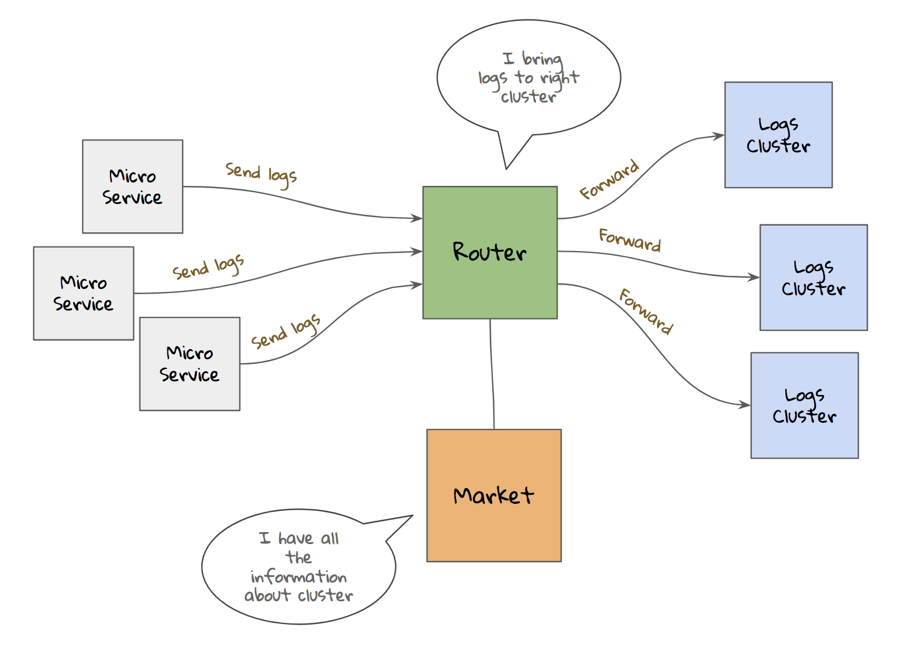
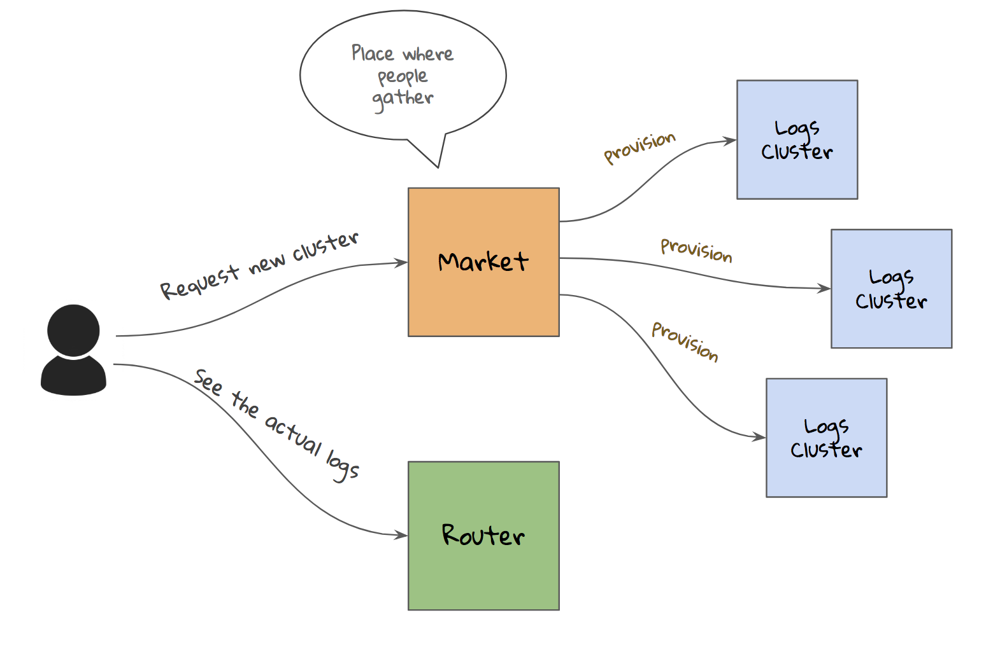
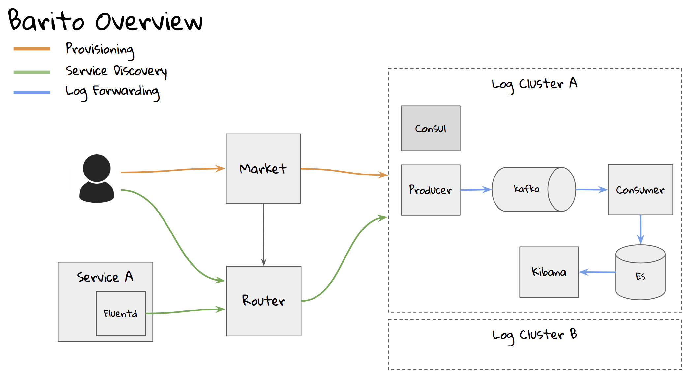
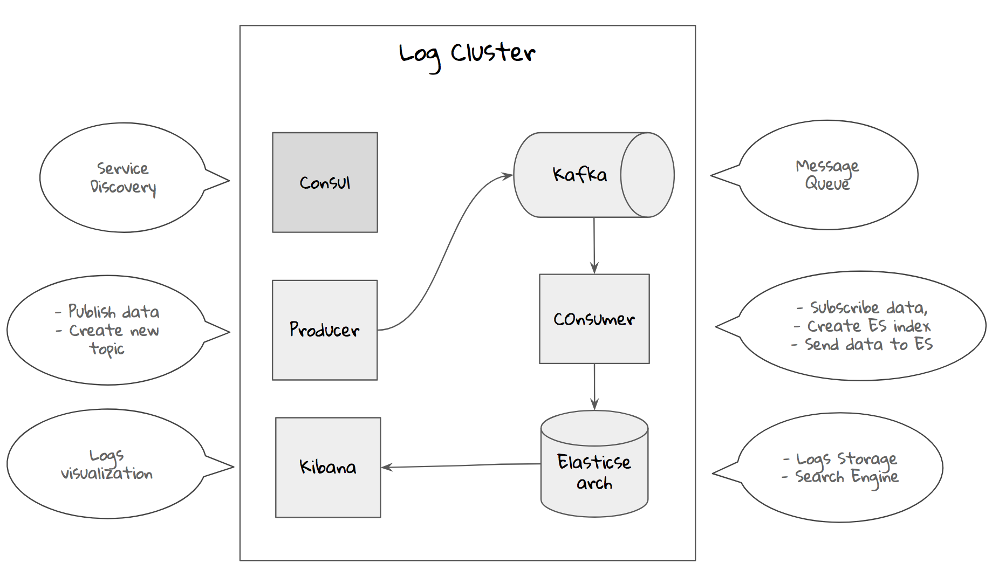
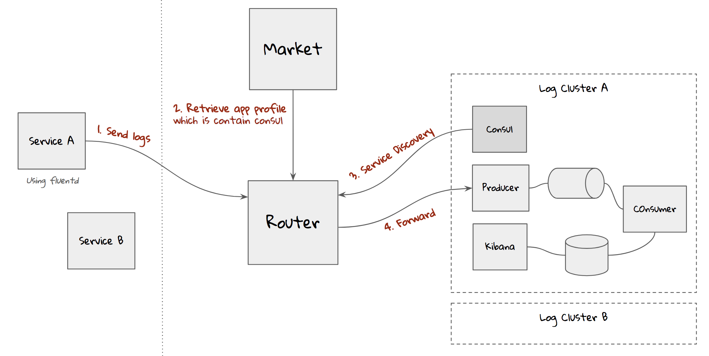
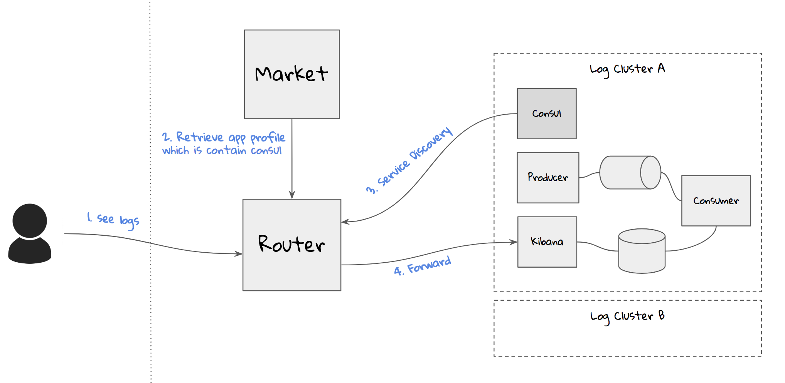
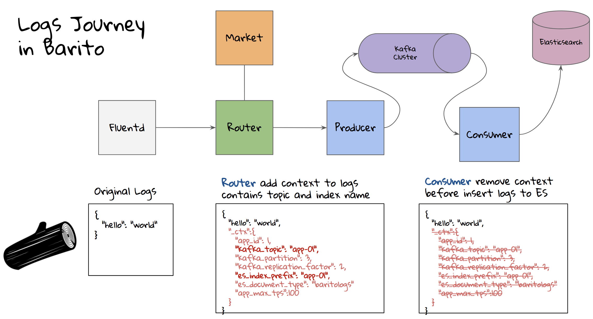

# Barito Log

> To get started quickly, please consult our quick development setup [here](https://github.com/BaritoLog/BaritoMarket)

The Barito Log project is aimed at making logs management simpler by developing platform for provisioning, managing, and monitoring logging pipeline cluster. 

The project name is inspired by timber rafting, which is a log transportation method in which logs are tied together into rafts and drifted or pulled across a water body or down a river. Barito is name of a big river located in South Kalimantan, Indonesia. 

## Introduction
Logs infrastructure ain't scale

Divide and conquer. With many logs cluster, how can a service know its logs cluster?

Router help service to discover the logs cluster. Router will communicate with Market to get application and logs cluster information.

Market is a web portal where user can request or get the information. But to access the actual logs cluster, router is the guy. 

## Overview

## Provisioning

Provisioning are done using our other open source project, called the [Pathfinder](https://github.com/pathfinder-cm)

## Service Discovery

## Log Forwarding

Consumer service will subscribe to `new_topic_events` to spawn new logs worker.

