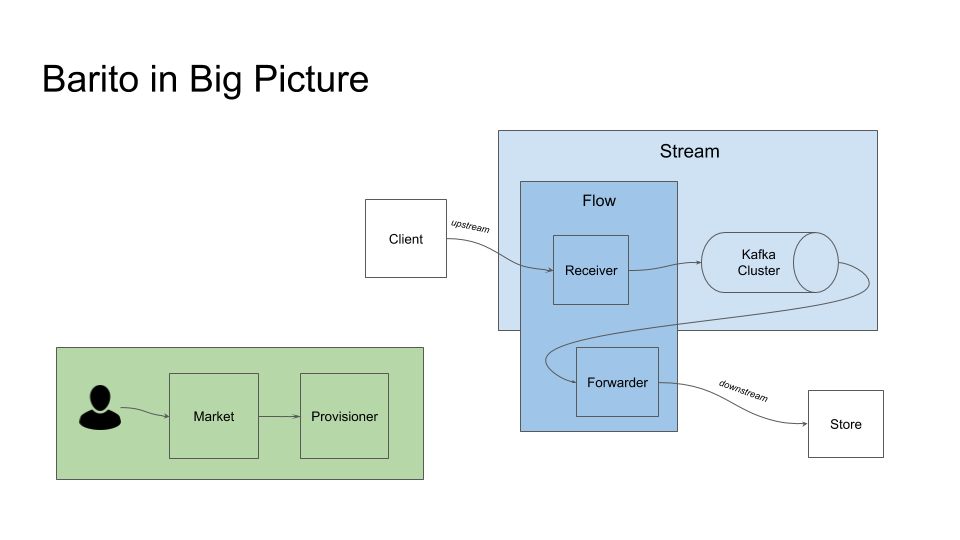

# Barito Log

## Introduction

The Barito Log project is aimed at making logs management simpler by developing interface for provisioning, managing, and monitoring elastic stacks.

Terms that used in this project:
- `Client` = collect the log in a service and sent it to a receiver
- `Receiver` = receive log from client and produce it to a kafka cluster
- `Forwarder` = consume kafka and forward it to a elastic stack
- `Market` = the portal and server 
- `Store` = a last place where log stored (Elasticsearch)
- `Flow` = both receiver and forwarder
- `Stream` = kafka with its receiver

Please check our [illustration](illustrations/readme.md) and [original requirement](original_requirement.txt)

## Philosophy

The project name is inspired by timber rafting, which is a log transportation method in which logs are tied together into rafts and drifted or pulled across a water body or down a river. Barito is name of big river located in South Kalimantan, Indonesia. 

## Logs Strategy

Fluentd --> Kafka --> Elasticsearch --> Kibana

## Provisioning Strategy

Terraform with chef or Yggdrasil (On Progress/On Discussion)

## Service Discover Strategy

Consul (On Progress/On Discussion)

## One Stop Management Tool

Barito Market (Rails)
1. Self Register Application
2. Management UI
3. Admin UI

## Projects 

- BaritoMarket: https://github.com/BaritoLog/BaritoMarket
- barito-flow: https://github.com/BaritoLog/barito-flow
- Barito-Fluent-Plugin: https://github.com/BaritoLog/Barito-Fluent-Plugin

## Tech Stacks

- Ruby On Rail 
- Go

## Getting Started

- [Getting started for development](getting-started-dev.md)
