# Barito Log

The Barito Log project is aimed at making logs management simpler by developing interface for provisioning, managing, and monitoring elastic stacks. 

## What's in a name?


The project name is inspired by timber rafting, which is a log transportation method in which logs are tied together into rafts and drifted or pulled across a water body or down a river. Barito is name of big river located in South Kalimantan, Indonesia. 

## Why?

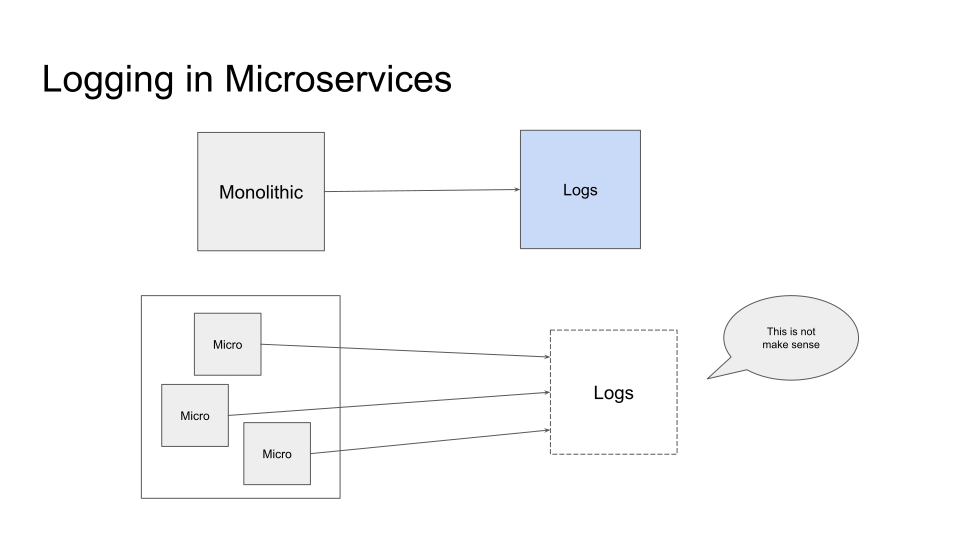
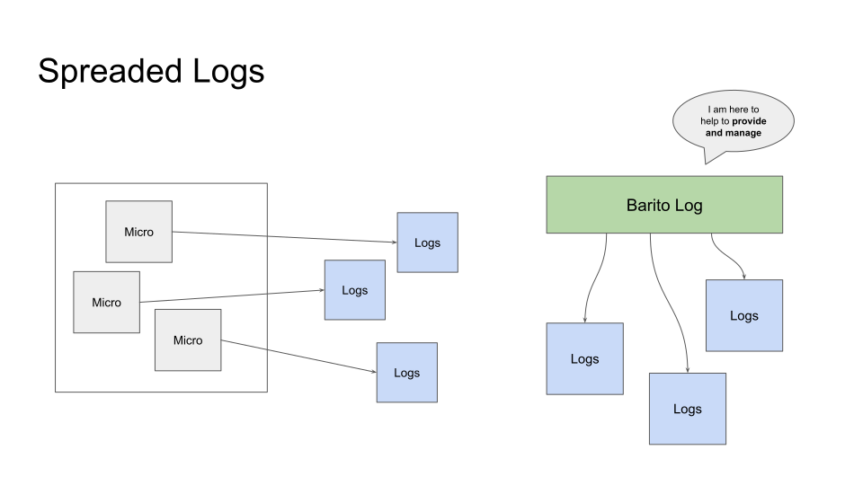

# Overview

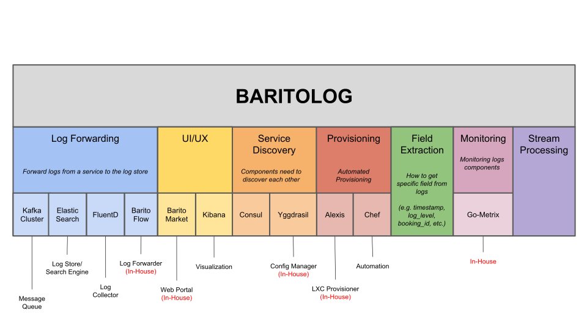
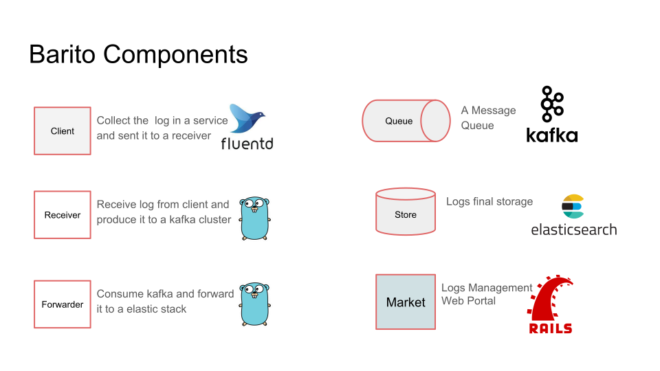

## Forwarding Strategy

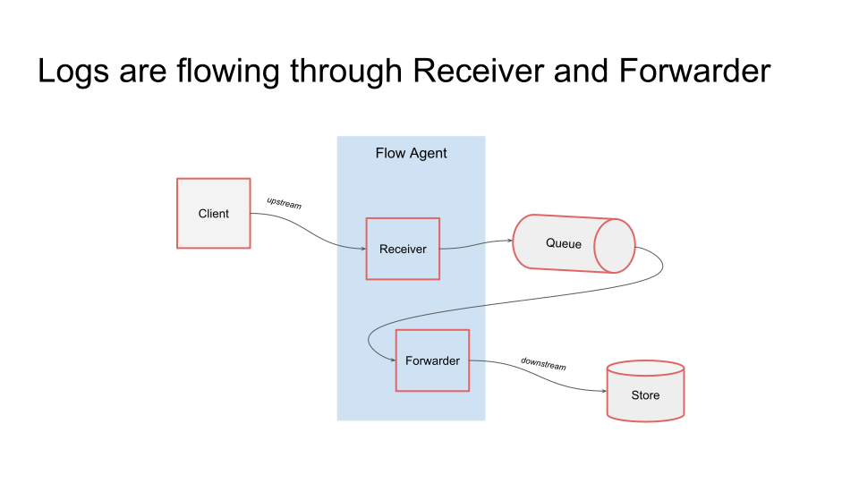
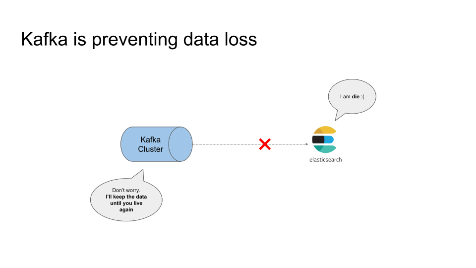
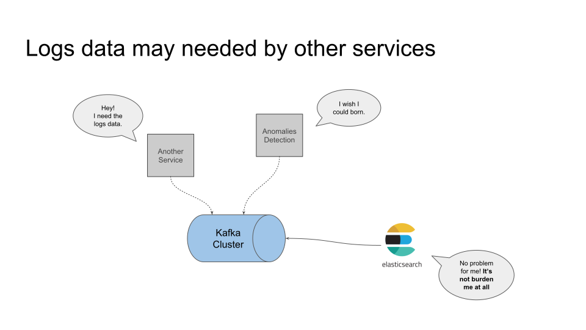

## Web Portal

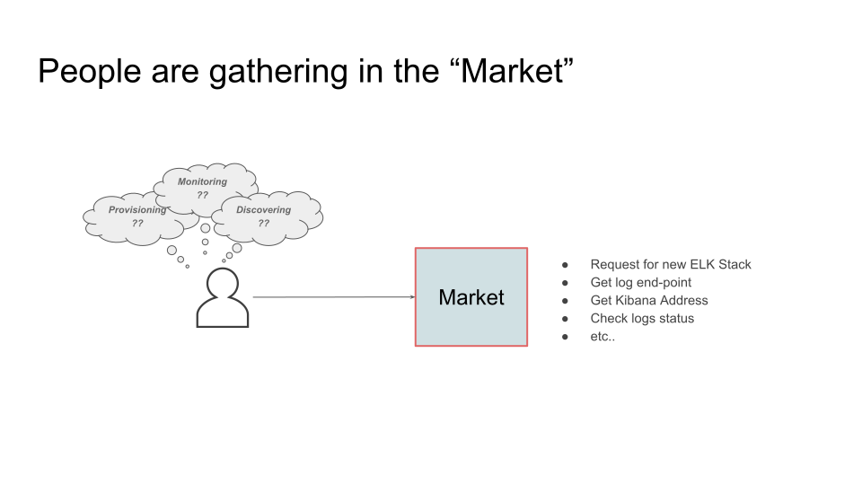

## Service Discovery

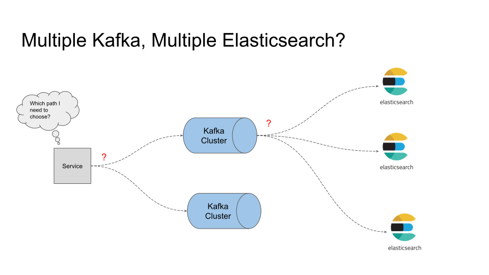
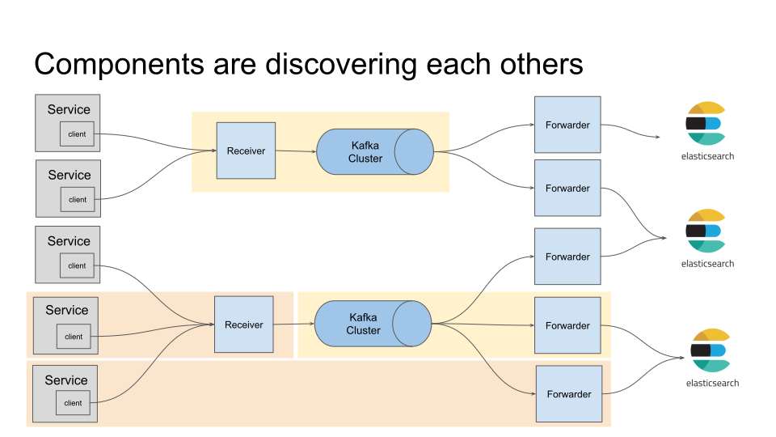

Strategy: Consul/Yggrasill (On Progress/On Discussion)

## Timber

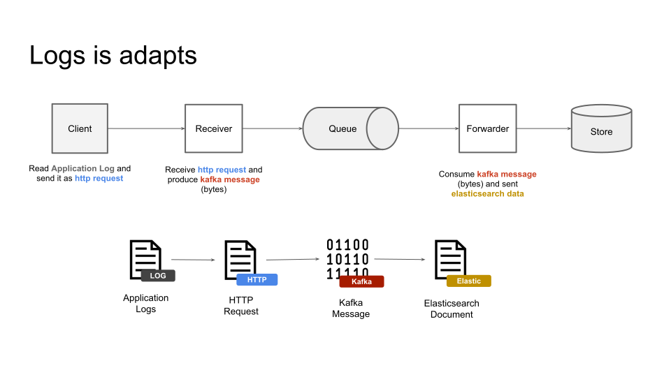
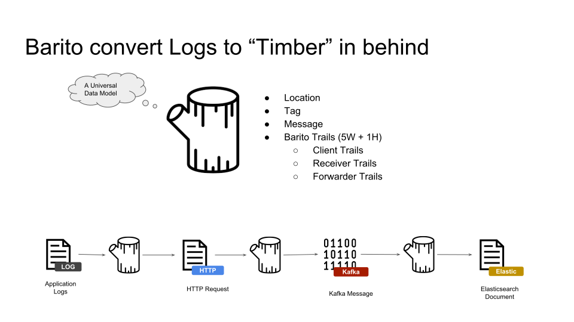

Timber is abstract model to logs data. 

Anatomy of Timber: 
1. `location`
2. `tag`
3. `@message` Log message
4. `@timestamp` Time when log created
4. `client_trail`
5. `receiver_trail`
6. `forwarder_trail`

Timber in json
```json
{
  "location": "some-topic",
  "tag": "barito",
  "@message": "qwerijsdfvx",
  "@timestamp": "2018-04-03T07:41:17Z",
  "client_trail": {
    "is_k8s": false,
    "sent_at": "2018-04-03T07:41:17Z",
    "hints": []
  },
  "receiver_trail": {
    "url_path": "/str/1/st/2/fw/3/cl/4/produce/some-topic",
    "received_at": "2018-04-03T07:41:17Z",
    "hints": []
  },
  "forwarder_trail": {
    "forwarded_at": "",
    "hints": []
  }
}
```

If `@message` is empty, client/receiver/forwarder will try to recovery it and give a hint. 

If `@timestamp` is empty, client/receiver/forwarder will try to recovery it and give a hint. 

All field related time (`@timestamp`, `sent_at`, `received_at`, `forwarded_at`) will save as `string`, `UTC` and `RFC3339` as the format. 


## Provisioning 

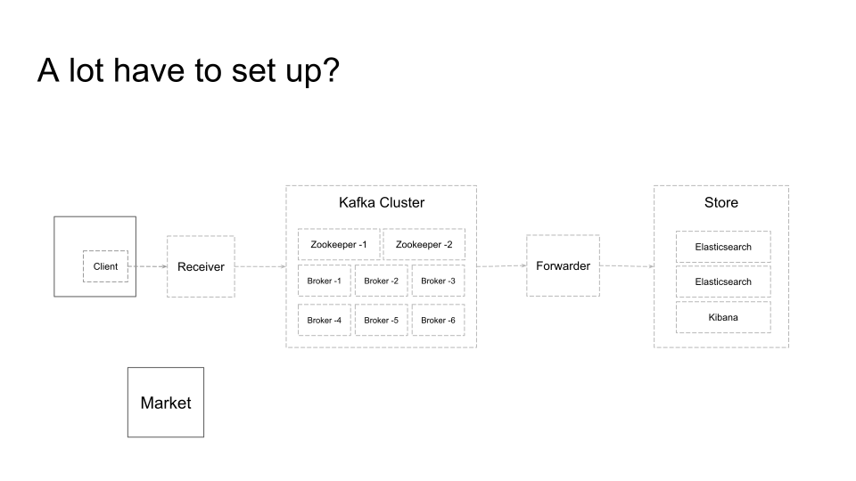


Strategy: Terraform with chef(On Progress/On Discussion)


## Stream Processing

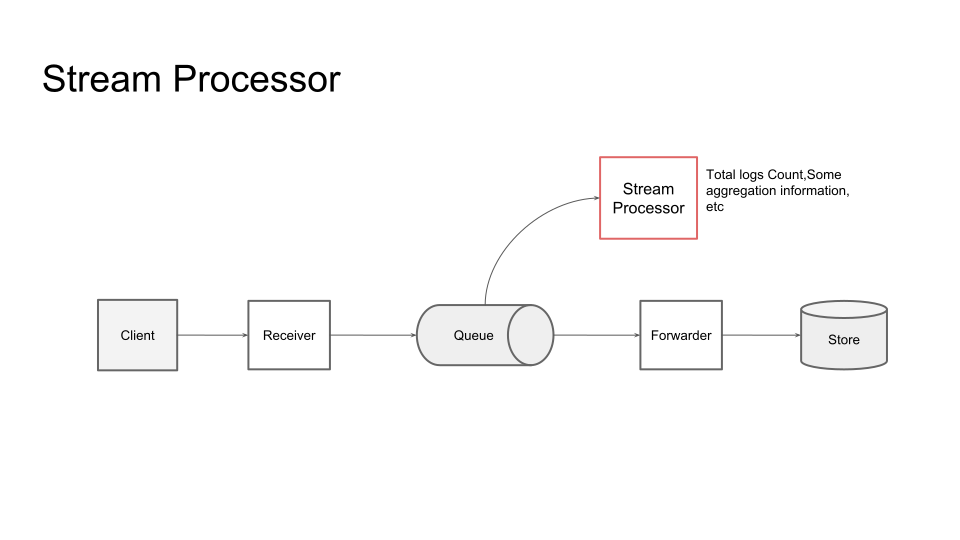

## Projects 

- BaritoMarket: https://github.com/BaritoLog/BaritoMarket
- barito-flow: https://github.com/BaritoLog/barito-flow
- Barito-Fluent-Plugin: https://github.com/BaritoLog/Barito-Fluent-Plugin

## Tech Stacks

- Ruby On Rail 
- Go

## Getting Started

- [Getting started for development](getting-started-dev.md)
