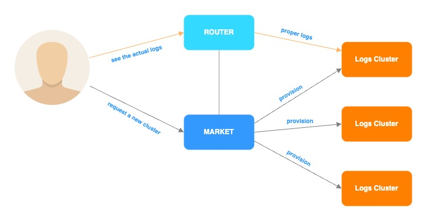

# Barito Log
Project aimed at making logs management simpler by developing a platform for provisioning, managing, and monitoring logging infrastructures.

# Introduction 
The project name is inspired from timber rafting, a log transportation method in which logs are tied together into rafts and drifted or pulled across a body of water or down a river. Barito is the name of a big river located in South Kalimantan, Indonesia.

Read the story behind Barito [here](https://blog.gojekengineering.com/how-we-built-barito-to-enhance-logging-19f80b89496f).

## Note
To get started quickly, please consult our quick development setup [here](https://github.com/BaritoLog/BaritoMarket)

# Architecture
## What's the problem?

- Logs infrastructure ain't scale

- Divide and conquer. With many logs cluster, how can a service know its logs cluster?

## Solution

- Router help service to discover the logs cluster. Router will communicate with Market to get application and logs cluster information.

- Market is a web portal where user can request or get the information. But to access the actual logs cluster, router is the guy. 

## Overview

## Provisioning

Provisioning are done using our other open source project, called the [Pathfinder](https://github.com/pathfinder-cm)

## Service Discovery

- Flow of sending logs from micro-service to Log cluster

- Flow of viewing logs from Log cluster

## Log Forwarding

- Log Flow Journey

- Consumer service will subscribe to `new_topic_events` to spawn new logs worker.

